# FLIPKART GRID 6.0 - ROBOTICS CHALLENGE
## SOLUTION BY TEAM SABARI132005


## Table of contents

- [Overview](#overview)
- [Screenshot](#screenshot)
- [Architecture Diagram](#my-process)
- [Built with](#built-with)
- [Installation](#installation)
- [Project structure](#structure)
- [Result Analysis](#resultanalysis)
- [Database storage](#database)
- [Author](#author)


## Overview
- This is a solution to the [Smart Vision Technology Quality Control in Flipkart Grid 6.0 - Robotics Challenge](https://unstop.com/hackathons/flipkart-grid-60-robotics-challenge-flipkart-grid-60-flipkart-1024253). 
- Our project is a real-time product detection and freshness monitoring system, leveraging YOLOv8 object detection to identify products, categorize them by brand, and evaluate the freshness of fruits and store it in the database.


## Screenshot
- ### Product detection, recognition and extraction
  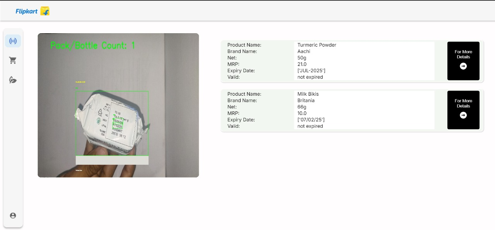
  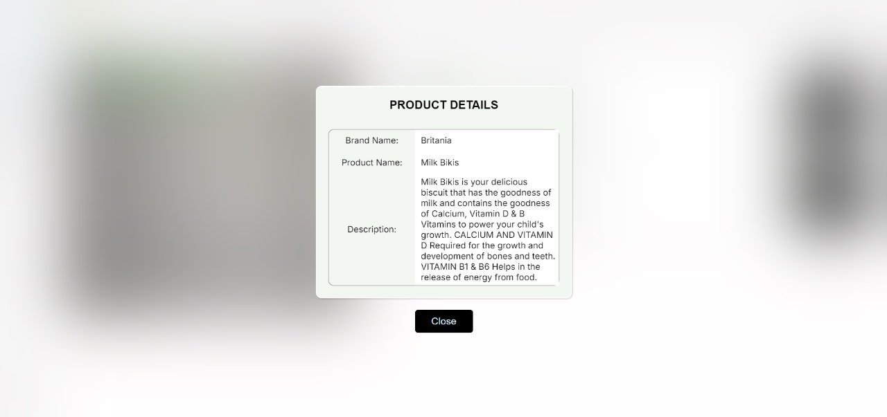

- ### Brand based counting
  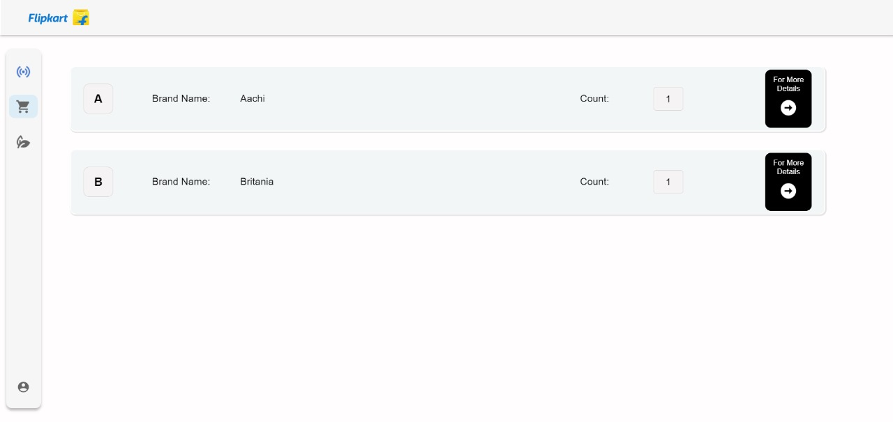
  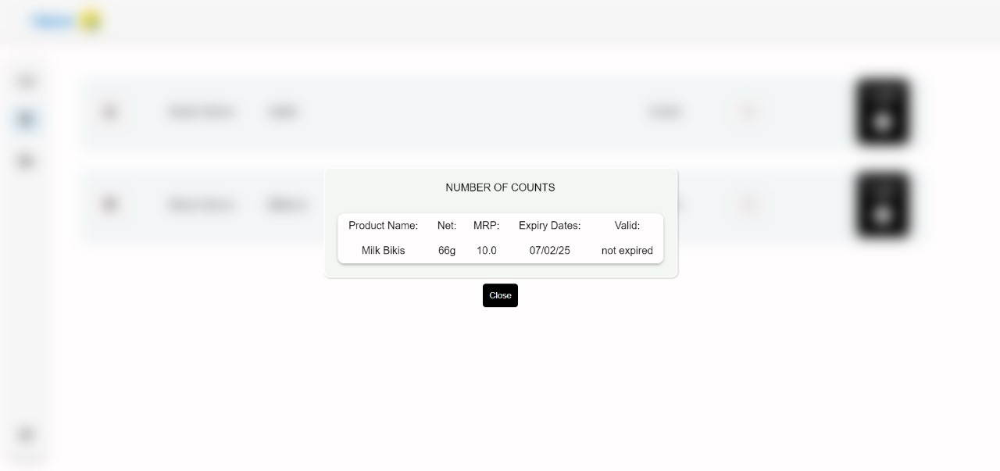

- ### Fruit freshness identification
  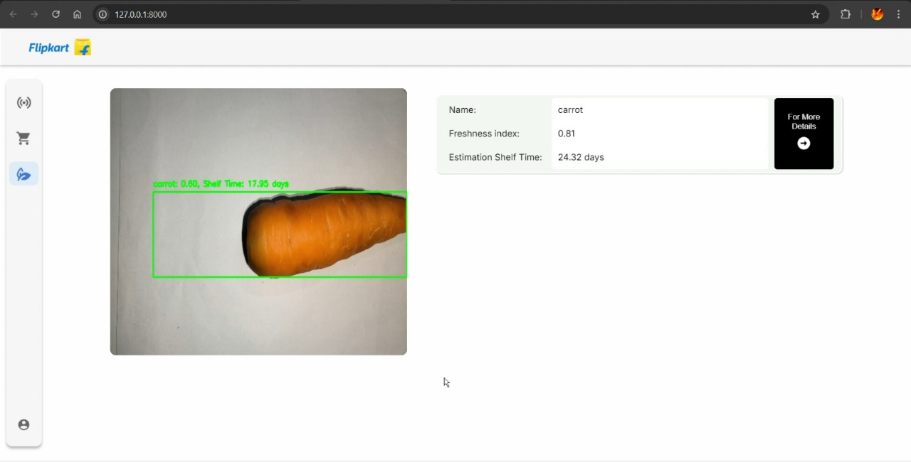
## Architecture Diagram

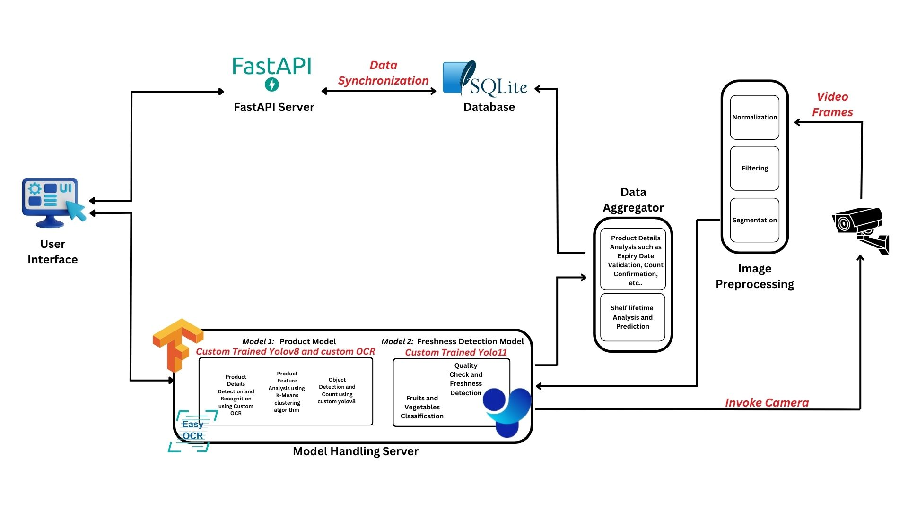

## Built with

- ### Frontend:
  - HTML, CSS, JS

- ### Backend:
  - FastAPI
  - Python
  - YOLOv8 for object detection
  - YOLOv11 (instant segmentation) for detecting fruit freshness
  - KMeans clustering algorithm
- ### Database
  - Sqlite3
- ### Libraries
  - `Ultralytics`
  - `Opencv-python`
  - `numpy`, `pandas` for data handling
  - `uvicorn` for FastAPI

## Installation

### Prerequrements
### Download the model and upload inside FlipKart_6.0
  - [Download](https://drive.google.com/file/d/1r2YWdnmE_Z7NA7dUX96Cw7Ie8TmvcU-x/view?usp=drive_link)
  

  - `Python3.11`
  - `DB Browser` - to see the database

### Installation steps

  ```
    git clone https://github.com/Sabari2005/FlipKart-Grid_6.0
    cd FlipKart-Grid_6.0
  ```
  ```
  pip install -r requirements.txt
  ```
  - In the `mode1_product.py`  `line 62` replace your webcam url

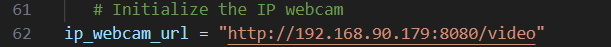

  - In the `model2_fruit.py` `line 31` replace your webcam url

 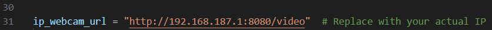 


  - Execute each commands in a seperate terminal
  ```
  python index.py
  python model1_fastapi.py
  python model2_fastapi.py
  ```
  - Open ` http://127.0.0.1:8000` in your browser

## Project structure

```
├──          
├── static
│   ├── css                    # Frontend styling files
│   └── images                 # Static images (if any)
├── templates
│   └── index.html             # Main HTML page
├── index.py   
├── model1_fastapi.py          
├── model2_fastapi.py                 
├── requirements.txt           # Python dependencies
└── README.md                  # This file
```
## Result Analysis

- ### Product details recognition and extraction model
    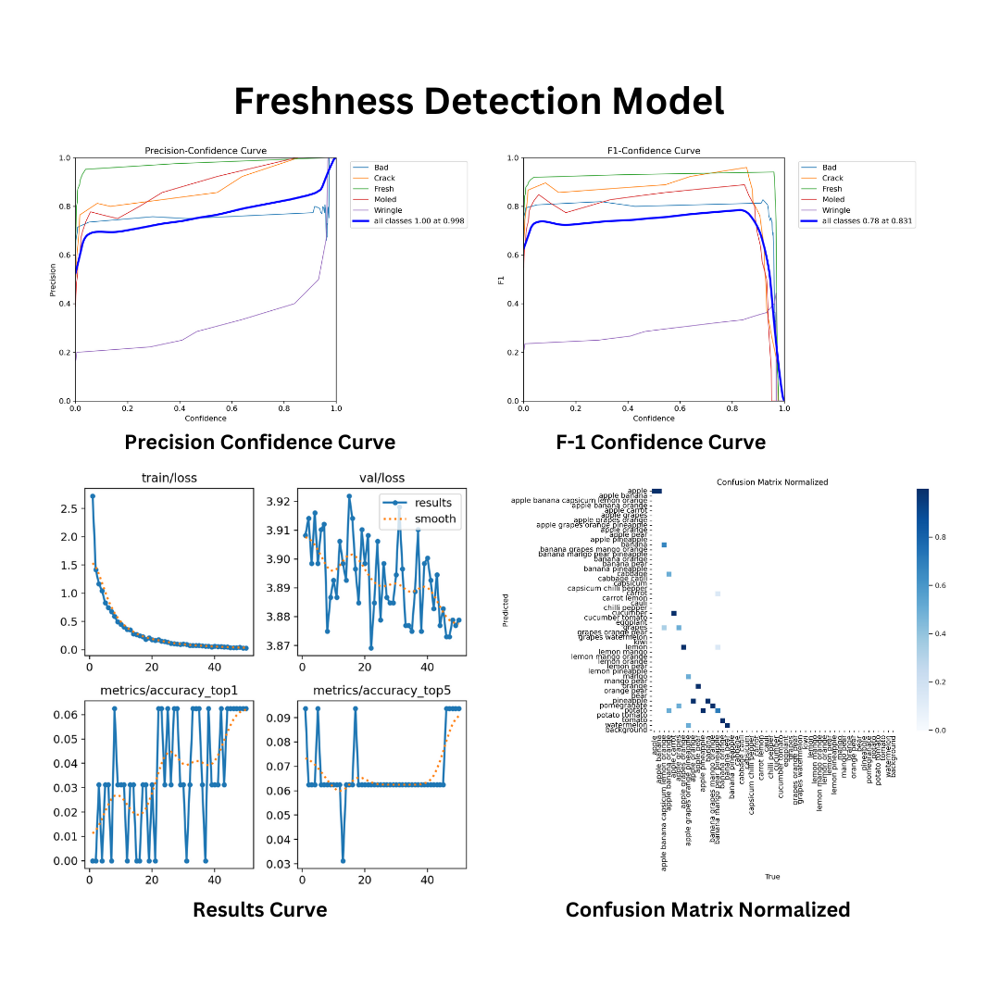 
    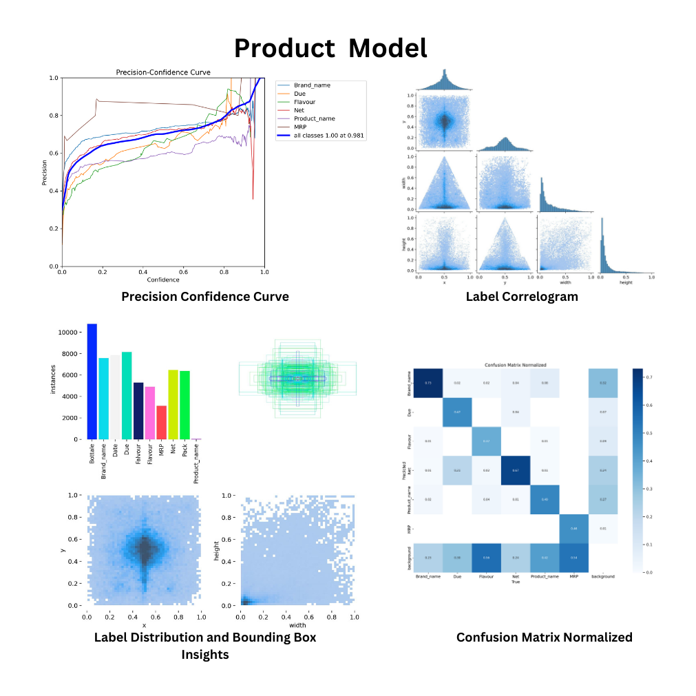 
    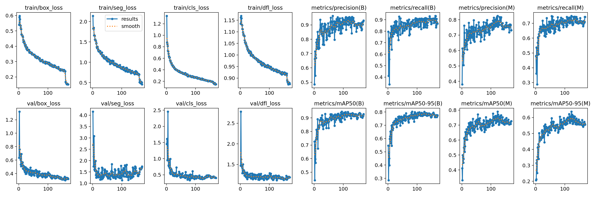 
- ### Fruit freshness detection model


## Sample model Output
- ### Product details detection and recognition model(real time images)
  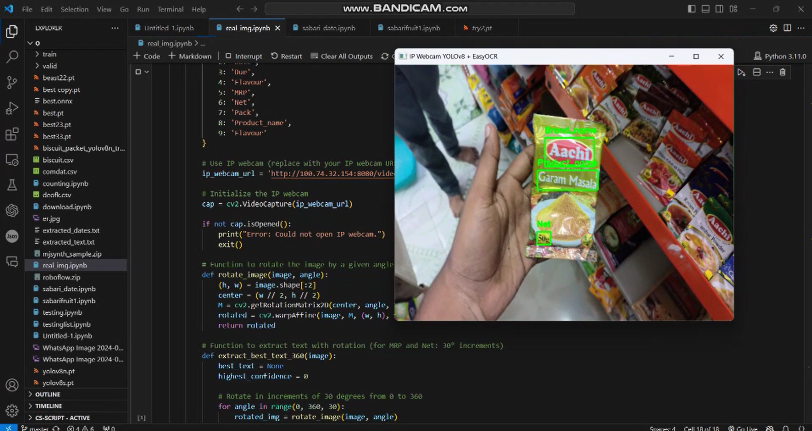 

   

## Database Storage

- you can see the product details in 
## Author

- Sabari Vadivelan S (Team Leader)
- Kamal M (Member 1)
- Uvarajan D (Member 2)
- Kaviarasu K (Member 3)
- Sarathi S (Member 4)


## See our PPT here

- [Download](https://docs.google.com/presentation/d/13D5QP3yGv6fAD_d8x2nDoX0ZLpIVwJJX/edit?usp=drive_link&ouid=108471139347338857018&rtpof=true&sd=true)
